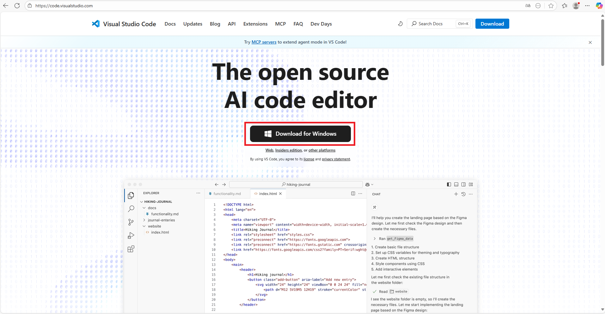

# 지청 신설 및 인원 배분 프로그램: 『조직계산기』 매뉴얼

## I. 프로그램 소개

- 조직계산기 프로그램은 지청 신설 및 지청별 정원 배분을 위해 작성한 프로그램이다.
- 프로그램은 python 으로 작성되었고, 입력과 출력은 xlsx 파일을 사용한다.
- 프로그램의 주요 기능은 다음과 같다.
  - 시군구별 원자료를 활용하여 지청별 자료를 생성한다.
  - 지청별 특정 컬럼값(또는 컬럼값의 가중치합)의 비율에 따라 다른 컬럼값을 비례하여 계산한다.
  - 특정 자료별로 가중치를 부여하여 전체 업무량과 1인당 업무량을 계산한다.
  - 사업체수 또는 종사자수 기준으로 추가인력을 지청에 배치할 수 있다.
  - 1인당 업무량을 기준으로 추가인력을 배치해야 하는 지청을 선정한다.

## II. 프로그램 실행을 위한 준비

- 조직계산기 프로그램 실행을 위해서는 먼저 Visual Studio Code와 Python을 설치해야 한다.
- 조직계산기 프로그램은 "https://github.com/barkle2/IA" 에서 다운로드 받을 수 있다.
  - 조직계산기 프로그램을 쉽게 다운로드 받기 위해서 git 프로그램을 설치하는 것을 추천한다.

### 1. VS Code(브이에스 코드) 설치

- 조직계산기 프로그램 실행을 위해서 Visual Studio Code 라는 프로그램을 설치한다.

- https://code.visualstudio.com/ 사이트에 접속해서 "Download for Windows"를 클릭한다.


- 파일을 다운로드한다.


- 다운로드 받은 파일을 실행하여 Visual Studio Code를 설치한다.
  - 설치에 대한 자세한 내용은 [비주얼 스튜디오 코드(VS Code) 설치 가이드](https://blog.naver.com/logic_edu/223904386852) 를 참조한다.
  - 링크의 3단계와 4단계만 참조하면 VS Code 설치는 완료된다.

### 2. Python(파이썬) 설치

- 조직계산기 프로그램 실행을 위해서 Python 을 설치한다.

- https://www.python.org/ 사이트에 접속해서 "Python 3.13.7" 버튼을 클릭한다.
  - 참고로 Python 버전이 업데이트 되면 Python 뒤의 숫자는 달라질 수 있으나, 큰 차이는 없다.


- 파일을 다운로드한다.


- 다운로드 받은 파일을 실행하여 Python을 설치한다.
  - 설치에 대한 자세한 내용은 [Python 설치하기](https://plug-and-play-life.tistory.com/36) 를 참조한다.
  - 링크의 [3. 파이썬 설치], [4. 설치 확인] 만 참조하면 된다.
  - 특히, "Add python.exe to PATH" 체크박스는 꼭 체크하세요.
    - 이 체크박스를 체크하지 않으면 VS Code 프로그램이 Python 프로그램을 찾지 못할 수 있다.
    - 물론 나중에 VS Code 프로그램에서 Python 위치를 지정할 수 있지만, 체크박스에 체크하면 문제없는데 굳이 그럴 필요는 없다.

### 3. git(깃) 설치

- 조직계산기 프로그램은 https://github.com/barkle2/IA 에서 다운로드 받을 수 있지만, git 프로그램을 설치하면 다운로드 과정이 편리해진다.

- https://git-scm.com/downloads 사이트에 접속해서 "Download for Windows" 버튼을 클릭한다.


- 다운로드 페이지에서 "Click here to download" 글자를 클릭해서 파일을 다운로드 한다.


- 다운로드 받은 파일을 실행하여 git을 설치한다.
  - 설치에 대한 자세한 내용은 [깃(Git) 다운로드 및 설치방법](https://m.blog.naver.com/efforthye/223042611627) 를 참조한다.
  - 이것저것 많이 물어보지만, 그냥 다 Next를 선택해도 괜찮다.

### 4. Workspace 폴더 만들기

- 조직계산기 프로그램을 다운로드 받을 폴더를 만들어두는게 좋다.
  - 윈도우 탐색기에서 D드라이브로 이동해 D:\Workspace 라는 폴더를 생성한다.

### 5. VS Code 에서 프로그램 다운로드 받기

- VS Code를 실행하면 다음과 같은 화면이 보인다.
- "Git 리포지토리 복제.." 를 클릭한다.


- "Git 리포지토리 복제.." 를 클릭하면 위쪽에 리포지토리 URL 을 입력하는 창이 생성된다.
- 이 칸에 "https://github.com/barkle2/IA" 를 입력한다.


- 그 다음 조직계산기 프로그램을 저장할 폴더를 지정한다.
- 이미 생성해둔 Workplace 폴더를 지정한다.


- 다음에는 자동으로 다운로드가 진행된다.
- 다운로드가 완료된 후에 IA 폴더가 생성되고 그림과 같이 폴더가 복사되면 작업이 완료된 것이다.


### 6. VS Code 확장 프로그램 설치하기

- 조직계산기 프로그램을 실행하기 위해서는 VS Code 확장 프로그램이 필요하다.

- 확장프로그램은 왼쪽 툴바에서 5번째 버튼을 클릭하면 설치할 수 있다.


- 설치해야 하는 확장프로그램은 다음과 같다.
  - Python
  - Jupyter
  - Excel Viewer

- VS Code 를 설치할 때 한글버전으로 변경했다면 "Korean Language Pack for Visual Studio Code"가 이미 설치되어 있을 것이다.
  - 설치가 되어 있지 않다면 지금이라도 설치하면 된다.

- 설치가 완료되었다면 다음과 같이 설치된 확장프로그램을 확인할 수 있다.


## III. 프로그램 실행하기

1. 프로그램이 설치된 폴더 찾기

- 조직계산기 프로그램은 [IA/정원/project_3] 폴더에 있다.
- 왼쪽 첫번째 툴바를 선택해서 [IA/정원/project_3]로 이동한다.

2. 라이브러리 설치하기

- "0_라이브러리_설치.py" 파일을 선택한다.


- 첫 번째 "셀 실행" 버튼을 누르면 대화형 창이 생성되면서 프로그램이 실행된다.
  - "셀 실행" 버튼을 누르는 대신 [Shift+Enter] 키를 눌러도 된다.
  - 그림처럼 초록색 체크가 생성되면 정상적으로 프로그램이 실행되는 것이다.


- 두 번째, 세 번째 "셀 실행" 버튼을 눌러 "0_라이브러리_설치.py" 파일을 실행한다.

- "!pip install ~" 명령어는 ~에 해당하는 모듈을 설치하는 명령어이다.
- 조직계산도 프로그램은 "pandas", "openpyxl", "scikit-learn" 모듈을 사용하기 때문에 해당 모듈을 설치해야 한다.

3. 조직계산도 프로그램 실행하기

- 조직계산도 프로그램은 3개의 py 파일로 구성된다.
  - 1_지청_자료_정리.py
  - 2_지청_신설.py
  - 3_인원_배분.py

- 프로그램 실행은 차례대로 "셀 실행" 버튼을 누르면 된다.
- 프로그램의 내용이 궁금하다면 프로그램을 복사해서 ChatGPT나 Gemini 등의 LLM 서비스에 넣고 자세히 해설해달라고 하면 된다.

- 1_지청_자료_정리.py 파일을 ChatGPT에 입력해서 설명해달라고 한 결과는 다음과 같습니다.

```
이 프로그램은 이렇게 작동합니다

자료 불러오기

두 가지 엑셀 파일을 읽어옵니다.
① 각 지방관서(청·지청·출장소)의 기본정보와 담당 구역(관할)
② 전국 시군구별 사업체 수, 종사자 수, 재해자 수 같은 통계

기본 점검

연번이 순서대로 되어 있는지,
청/지청 이름이 이상 없는지,
관할 지역 이름이 제대로 되어 있는지 등을 확인합니다.
통계에 있는 시군구와 관할에 적힌 시군구를 비교해서, 빠진 지역이나 잘못된 이름이 있는지도 찾아줍니다.

데이터 정리

‘지청+규모’를 합쳐서 기관명을 만들고,
각 청마다 어떤 기관들이 있는지 목록을 보기 좋게 출력합니다.

정원 확인

총 정원 숫자가 안전·노동 정원을 합한 값과 맞는지 점검합니다.

통계 합산하기

각 지청이 담당하는 시군구의 통계를 합쳐서,
→ 지청 단위의 사업체 수, 종사자 수, 재해자 수 등을 계산합니다.

결과 저장

이렇게 합산된 결과를 새로운 엑셀 파일로 저장합니다.
최종 파일에는 각 지청별로 관할, 정원, 사업체 수, 종사자 수, 재해자 수 같은 주요 지표가 정리되어 들어갑니다.

👉 한마디로 말하면,
**“시군구 단위 자료를 모아서 지청 단위로 합계해 주고, 기본 오류를 점검한 뒤 정리된 결과를 새로운 엑셀 파일로 만들어주는 프로그램”**이에요.
```


